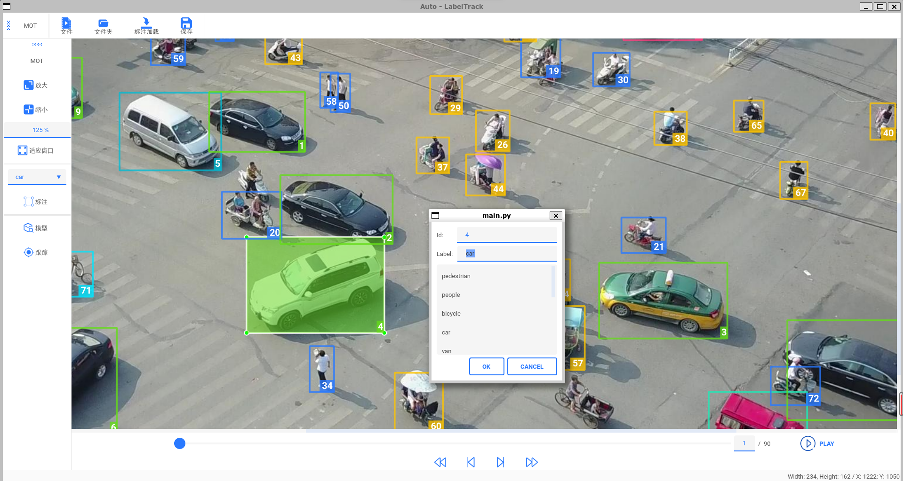

# LabelTrack

**LabelTrack是为多目标跟踪```MOT```写的一个自动标注工具**



## 安装
```
git clone https://github.com/DD-DuDa/LabelTrack.git
cd LabelTrack/Tracking
pip install -r requirements.txt
pip install cython
pip install 'git+https://github.com/cocodataset/cocoapi.git#subdirectory=PythonAPI'
pip install cython_bbox
python setup.py develop
```

## 主要功能
* 导入mp4文件或视频帧文件夹
* 手动标注
* 修改标注框，包括大小，标签，ID等信息
* **采用SOTA目标跟踪模型对视频帧进行预跟踪**
* 导出和导入VisDrone格式数据集

## 快捷键
|  键位   | 功能  |
|  ----  | ----  |
| w  | 标注 |
| s, del  | 删除所选标注框 |
| ctrl + 滚轮 | 放大，缩小 |

## 使用方法
1. 下载对应模型权重
* [bytetrack_m_mot17.pth.tar (code:2zkp)](https://pan.baidu.com/s/1M-nw-eKrPs3yj9XZ5ryArA)
* [yolox_l_best_ckpt.pth.tar (code:493b)](https://pan.baidu.com/s/1C8pgalxsC2MGGrcB175iiQ)
* [yolox_m_vd.pth.tar (code:y9qv)](https://pan.baidu.com/s/1agpN4O7JsqetGHN6bn7qfw)
* [yolox_tiny_best_ckpt.pth.tar (code:v4u1)](https://pan.baidu.com/s/1Rs96E0TmW3cIXUvrmrjA2w)
2. 修改```./Tracking/configs```中的yaml文件（exp_file, ckpt）
```
cd LabelTrack
python main.py
```
```./Tracking/videos``` 有demo视频

## 已更新
* 【2022.7.16】上传权重文件（百度网盘）
* 【2022.5.31】取消所有标注框，手动标注框延续所有帧
* 【2022.5.14】标注图片大小缩放，拖拽；工具栏等按钮完善；标注类别有11种

## 待更新
- [ ] 操作错误提醒完善
- [ ] 手动标注框的ID从没有出现的开始
- [ ] 手动标注框的更新*
- [ ] 更多需要的功能

## 参考
1. https://github.com/tzutalin/labelImg
2. https://github.com/ifzhang/ByteTrack

## B站视频
https://www.bilibili.com/video/BV15Y4y137Fp/
